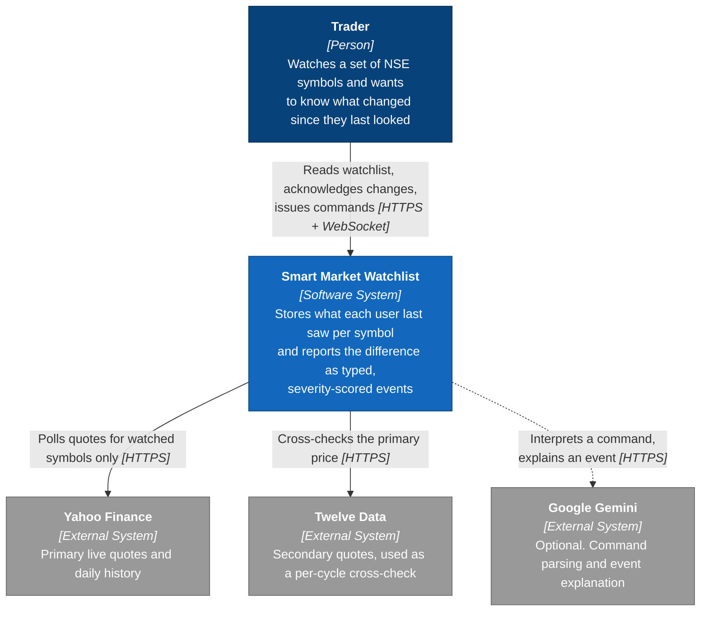
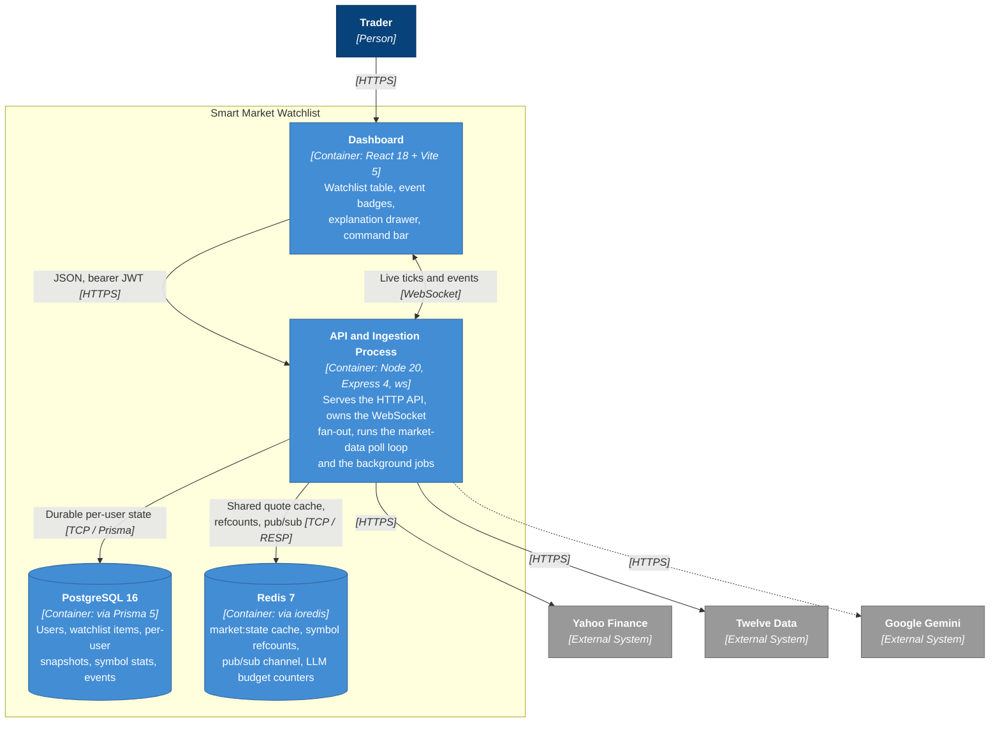

# Smart Market Watchlist

A watchlist application that reports **what changed** on each tracked symbol since the
user last looked at it, rather than re-displaying the current quote. Every symbol a user
watches carries a server-side snapshot of what that user last saw; each request to the
watchlist recomputes the difference between that snapshot and the current state and
returns it as a list of typed, severity-scored events.

## What the system does

- **Per-user snapshots.** For every `(user, symbol)` pair the backend stores the last
  price, volume and 52-week band the user acknowledged. Reading the watchlist never
  changes this snapshot; only an explicit acknowledge (`POST /api/watchlist/ack`) does.
  A page refresh therefore cannot silently clear an unseen change.
- **Typed event model.** Differences are classified into seven event types
  (`PRICE_MOVE`, `VOLUME_SPIKE`, `GAP_OPEN`, `FIFTY_TWO_WEEK_EXTREME`, `NEWS`,
  `RATING_CHANGE`, `CORPORATE_ACTION`) and each is scored `MINOR` / `NOTABLE` /
  `CRITICAL` against the symbol's own statistics, not against a fixed percentage.
- **Real news and corporate actions.** Headlines come from Google News' India-scoped RSS
  search and dividends/splits from Yahoo's chart endpoint; both are ingested, deduplicated
  and scored on a schedule. News severity measures how much is being published relative to
  what that symbol normally draws — never what the headlines say. Analyst rating changes
  have no free source covering NSE, which the app reports as an unsupported feed rather
  than as an absence of ratings.
- **Decision traces.** Every event carries the inputs, the arithmetic, the thresholds
  tested and the provenance of the underlying quote. The frontend renders this trace
  when an event badge is opened.
- **Two data-source modes.** In `live` mode a composite provider polls Yahoo Finance as
  the primary source and Twelve Data as a per-cycle cross-check, falling back to a
  synthetic replay engine per symbol. In `replay` mode the whole application runs on the
  replay engine with no external calls. The source and mode of every quote are labeled
  in the API response.
- **Shared ingestion.** Market data is polled once per distinct watched symbol and
  cached in Redis, reference-counted so a symbol is only polled while at least one user
  watches it. Cost scales with distinct symbols, not with user count.
- **Real-time updates.** State changes are published on Redis pub/sub and fanned out to
  dashboards over a single WebSocket server.
- **Optional assistant.** A natural-language command bar and a plain-English event
  explainer. Both run on deterministic code by default and use Google Gemini only when a
  key is configured; neither feature requires the LLM to function.

## Architecture

**System context** — what this is and what it talks to:



**Containers** — the separately runnable moving parts:



The component-level diagram and the two sequence diagrams (read/ack flow, one ingestion
poll cycle) are in [docs/diagrams.md](docs/diagrams.md).

## Repository structure

The backend is arranged as four concentric rings, ordered by how often the code inside
them changes. **Dependencies point inward** — from volatile detail toward stable business
rules, never the reverse. That is the whole design, and it is enforced by lint rules in
`eslint.config.mjs` rather than left to convention: `npm run lint` fails if `domain/`
imports Express, or a route reaches past a service into Prisma.

```
.
├── docker-compose.yml       Postgres 16 + Redis 7 for local development
├── eslint.config.mjs        Shared lint config — including the ring boundary rules
├── backend/                 Node + TypeScript API, ingestion, diff engine
│   ├── prisma/              Schema, migrations, universe seed script
│   ├── scripts/             verify-live-data.ts (live provider check)
│   ├── tests/
│   │   ├── unit/            Mirrors the ring under test; no I/O, runs in seconds
│   │   ├── integration/     Boots the real Express app over real HTTP
│   │   └── setup/           Environment the config validator demands, as a Vitest setupFile
│   └── src/
│       ├── server.ts        Composition root — the one entry point
│       ├── config/          Environment parsing and validation (cross-cutting)
│       │
│       ├── domain/          ── ring 1: business rules. No framework, driver or vendor.
│       │   ├── diff/            Diff engine, severity scoring, explanation traces
│       │   ├── market/         Symbol universe, volatility profiles, divergence
│       │   ├── assistant/      Deterministic command parser, the closed action set
│       │   ├── watchlist/      Watchlist DTOs and domain errors
│       │   ├── auth/           JwtPayload
│       │   └── ports/          MarketDataProvider — the contract adapters implement
│       │
│       ├── application/     ── ring 2: use cases. Knows no HTTP.
│       │   ├── watchlist/      Add, remove, diff, ack
│       │   ├── auth/           bcrypt, JWT issue and verify
│       │   ├── assistant/      Command execution and event explanation
│       │   ├── ingestion/      Refcounted subscriptions, the single market:state writer
│       │   ├── market-data/    Poll loop, historical backfill, staleness sweep
│       │   ├── stats/          Periodic SymbolStats recompute
│       │   └── jobs/           Interval scheduler
│       │
│       ├── infrastructure/  ── ring 3: technology detail. Swappable.
│       │   ├── db/             Prisma and Redis clients
│       │   ├── market-data/    Yahoo / Twelve Data / replay adapters, read model, admin queue
│       │   ├── llm/            Gemini client, Redis-backed budget guard, intent schema
│       │   └── pubsub/         Redis pub/sub bridge
│       │
│       └── interfaces/      ── ring 4: delivery. Outermost, most volatile.
│           ├── http/           Express app, routes, middleware
│           └── ws/             WebSocket server, auth, protocol
│
└── frontend/                React + Vite dashboard
    └── src/
        ├── api/             axios client and typed endpoint wrappers
        ├── context/         Auth/session context
        ├── hooks/           TanStack Query hooks (watchlist, ack)
        ├── ws/              WebSocket hook
        ├── pages/           Login, Register, Dashboard, Admin demo
        ├── components/      Watchlist table, event badge, explain drawer, command bar
        └── types/           Shared response types mirroring the backend
```

## Technology

| Layer       | Components                                                                                                        |
| ----------- | ----------------------------------------------------------------------------------------------------------------- |
| Backend     | Node, Express 4, TypeScript, `ws`                                                                                 |
| Persistence | PostgreSQL 16 via Prisma 5 (durable per-user state); Redis 7 via ioredis (shared cache + pub/sub + LLM budget)    |
| Market data | Yahoo Finance (live primary), Twelve Data (live cross-check), synthetic replay engine                             |
| Frontend    | React 18, Vite 5, TanStack Query 5, React Router 6, Tailwind CSS 3                                                |
| Assistant   | Google Gemini (`generateContent`), optional; deterministic parser and computed explanations otherwise             |
| Tests       | Vitest, split into unit (no I/O) and integration (real app over real HTTP)                                        |
| Tooling     | ESLint 10 flat config with architecture boundary rules, Prettier, husky + lint-staged, commitlint, GitHub Actions |

## Running the project

```bash
docker compose up -d          # Postgres 16 + Redis 7

npm run install:all           # root tooling, then backend, then frontend
cp backend/.env.example backend/.env
cp frontend/.env.example frontend/.env
npm run prisma:migrate --prefix backend

npm run dev --prefix backend  # http://localhost:4000
npm run dev --prefix frontend # http://localhost:5173
```

With no `TWELVE_DATA_API_KEY` set the backend runs entirely on the replay engine and
needs no external services beyond Postgres and Redis. The full walkthrough — scripts,
environment reference, authentication model and the demo control panel — is in
[docs/setup.md](docs/setup.md).

## Quality checks

Run from the repository root, in the same order CI runs them — cheapest first, so a
formatting mistake is reported in seconds rather than after a build:

```bash
npm run format:check && npm run lint && npm run typecheck && npm test
```

| Command                    | What it covers                                                         |
| -------------------------- | ---------------------------------------------------------------------- |
| `npm run lint`             | Both packages, **including the ring boundary rules** described above   |
| `npm run format:check`     | Prettier, repo-wide                                                    |
| `npm run typecheck`        | `tsc --noEmit` in backend and frontend                                 |
| `npm run test:unit`        | 106 tests over the inner rings and 65 over `frontend/src/lib/`; no I/O |
| `npm run test:integration` | 7 tests driving the real Express app over HTTP                         |
| `npm run build`            | Backend `tsc` build and frontend Vite build                            |

A pre-commit hook runs lint and formatting over staged files; a commit-msg hook enforces
[Conventional Commits](https://www.conventionalcommits.org/). See
[CONTRIBUTING.md](CONTRIBUTING.md).

## Documentation

| Document                                                       | Contents                                                                                                                                                                             |
| -------------------------------------------------------------- | ------------------------------------------------------------------------------------------------------------------------------------------------------------------------------------ |
| [CONTRIBUTING.md](CONTRIBUTING.md)                             | Setup, the ring rule, commit and pull-request conventions, where a new test belongs                                                                                                  |
| [docs/setup.md](docs/setup.md)                                 | Prerequisites, backend and frontend setup, npm scripts, full environment-variable reference, authentication model, demo control panel                                                |
| [docs/architecture.md](docs/architecture.md)                   | Process startup, data stores, ingestion pipeline, provider composition, the snapshot/diff model, real-time delivery, background jobs, HTTP API and WebSocket protocol, source layout |
| [docs/diagrams.md](docs/diagrams.md)                           | C4 context, container and component diagrams, plus sequence diagrams for the read/ack flow and one ingestion poll cycle — all Mermaid, all committed                                 |
| [docs/adr/](docs/adr/)                                         | Architecture Decision Records: why the monolith, why the rings, why the boundaries are lint rules                                                                                    |
| [docs/assistant.md](docs/assistant.md)                         | Command-bar pipeline, intent set, the explanation-trace structure, the Gemini client and budget guard, configuration                                                                 |
| [docs/scope-and-limitations.md](docs/scope-and-limitations.md) | Deliberate simplifications and known gaps, grouped by area; each is also marked in code                                                                                              |
