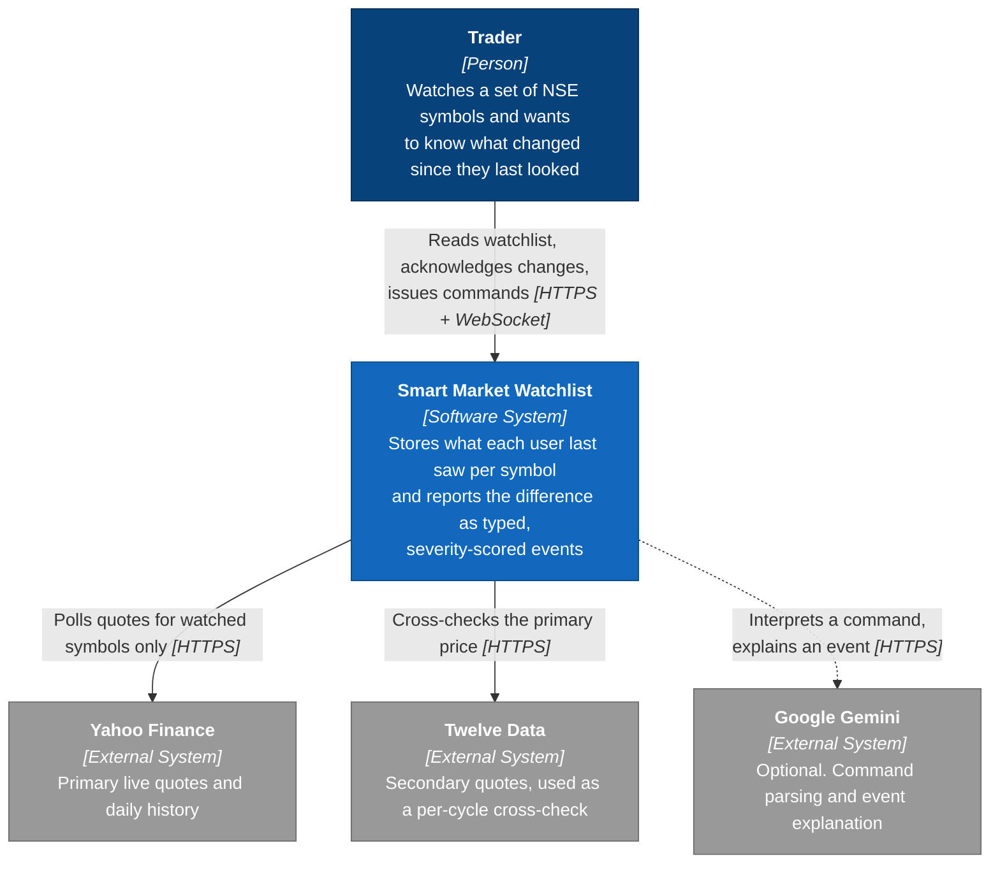
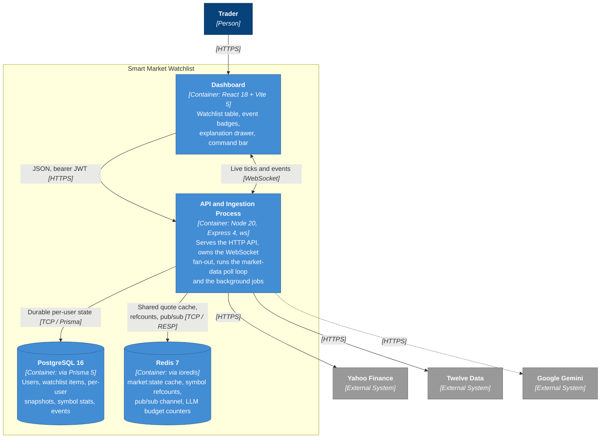
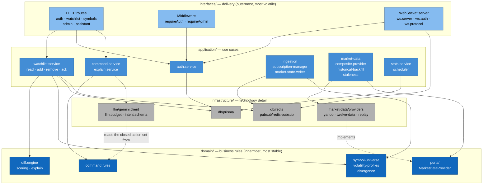
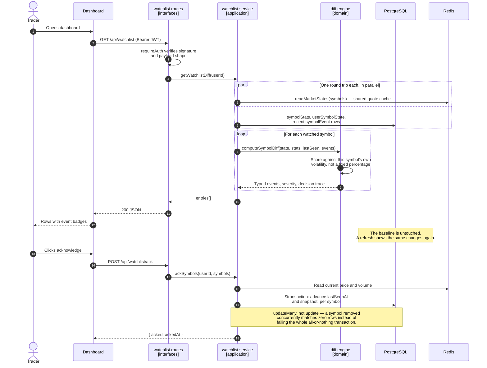
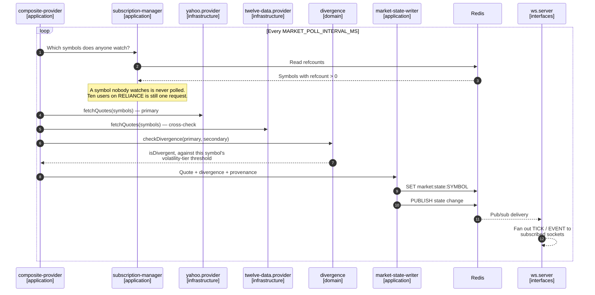

# Architecture diagrams

Four diagrams at three zoom levels, following the [C4 model](https://c4model.com/), plus
two sequence diagrams for the flows that cross the most boundaries.

They are written in Mermaid and committed next to the source rather than exported as
images into a wiki. That is not a stylistic preference. A PNG rots because updating it
means opening a drawing tool, so nobody does — and a stale diagram is worse than no
diagram, because it is confidently wrong. A diagram defined in text can be changed in the
same pull request as the code it describes, and a reviewer can see when it wasn't.

Mermaid's own `C4Context` / `C4Container` syntax is still marked experimental and renders
inconsistently, so these use `flowchart` with the C4 _semantics_: one box per person,
system, container or component, with every arrow labelled by intent and technology.

---

## Level 1 — System Context

**Audience:** anyone, including non-engineers.
**Question it answers:** what is this, and what does it talk to?

Every external dependency is optional in a specific, tested way. With no
`TWELVE_DATA_API_KEY` the system runs in `MARKET_DATA_MODE=replay` against a synthetic
engine and makes no outbound calls at all; with no `GEMINI_API_KEY` the assistant falls
back to its deterministic parser. The dashed arrow marks the one that stays optional even
when it _is_ configured — the budget guard degrades the assistant to its deterministic
path rather than failing the request.

---

## Level 2 — Containers

**Audience:** engineers and operators onboarding.
**Question it answers:** what are the separately runnable moving parts?

**Why the API and the ingestion loop are one container.** They are separable in principle
and are deliberately not separated, because nothing yet forces it: no part needs to scale
independently of another, and no second team owns a piece of it. Splitting now would buy
network latency, partial failure and distributed debugging in exchange for nothing.

What the single container does cost is that exactly one instance may run the poll loop.
`market:state` is shared mutable state, so a second writer is not a harmless duplicate —
it overwrites live prices with stale ones. That is enforced by binding the HTTP port
_before_ ingestion starts, which makes the port the mutex: a duplicate process exits with
`EADDRINUSE` instead of quietly corrupting the cache. See `backend/src/server.ts` and
[ADR 0002](adr/0002-modular-monolith-and-single-writer-ingestion.md).

---

## Level 3 — Components inside the API process

**Audience:** the engineer working inside the backend.
**Question it answers:** what are the internal parts, and which way do they depend?

The four boxes are the four rings. **Every arrow points inward or sideways; none points
outward.** That is the whole design — and it is enforced by the boundary rules in
`eslint.config.mjs`, not merely drawn here.

The dotted arrows are the inversions that matter.
`infrastructure/market-data/providers` **implements** `domain/ports/MarketDataProvider`:
the poll loop depends on the interface, which is what makes Yahoo, Twelve Data and the
synthetic replay engine interchangeable and lets a test substitute a fake with no network.
`infrastructure/llm/intent.schema` reads `ASSISTANT_ACTIONS` from the domain, so the enum
offered to the model cannot drift from the enum the validator enforces.

---

## Sequence — reading the watchlist, then acknowledging

The core interaction, and the one that explains why the snapshot is stored server-side.
The read is **non-destructive**: it never advances the baseline. Only an explicit ack does,
which is what makes a page refresh unable to silently clear an unseen change.

---

## Sequence — one ingestion poll cycle

Why cost scales with distinct watched symbols rather than with user count.

On boot the refcounts are rebuilt from the durable `WatchlistItem` table, because Redis
holds no durable state and the "poll only what is watched" design silently breaks after a
Redis restart otherwise. That reconciliation is a required startup step in
`backend/src/server.ts`, not optional polish.
